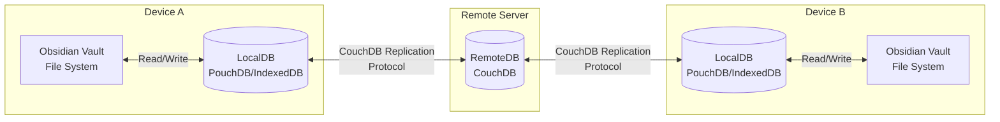
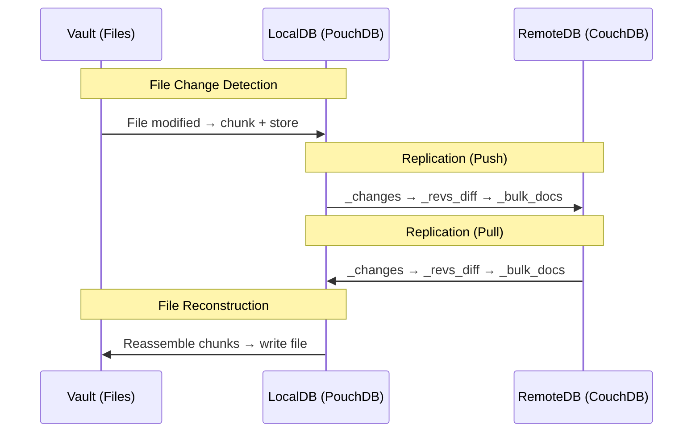
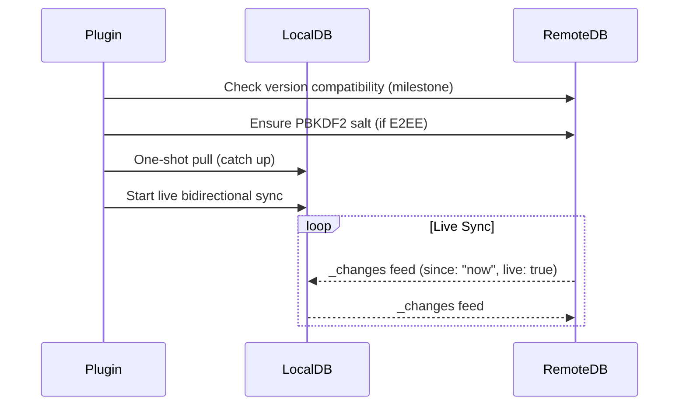

# Architecture Overview

## System Components

Obsidian LiveSync synchronises an Obsidian vault between multiple devices via CouchDB as a relay server. The architecture consists of three layers:



### Layer Roles

| Layer | Technology | Role |
|-------|-----------|------|
| **Vault** | Obsidian File System API | Source of truth for file content on each device |
| **LocalDB** | PouchDB (IndexedDB backend) | Local replica of the database; change tracking and offline support |
| **RemoteDB** | CouchDB (or compatible) | Central relay; multi-master replication hub |

## Data Flow



### Write Path (Vault to DB)

1. File change detected in the vault (modify/create/delete)
2. File content is split into chunks (see [chunking.md](./chunking.md))
3. Each chunk is hashed to produce a chunk ID (see [chunking.md](./chunking.md#chunk-id-generation))
4. If E2EE is enabled, chunks are encrypted before storage (see [encryption.md](./encryption.md))
5. A metadata document (entry) is created/updated pointing to chunk IDs
6. File path is converted to a document ID (see [data-model.md](./data-model.md#file-path-to-document-id))

### Read Path (DB to Vault)

1. Entry document received via replication
2. Chunk IDs (`children`) are resolved by fetching `EntryLeaf` documents
3. If E2EE is enabled, chunks are decrypted
4. Chunks are concatenated to reconstruct file content
5. File is written to vault

## Sync Modes

The plugin supports multiple synchronisation modes:

| Mode | API Call | Description |
|------|---------|-------------|
| **One-shot Sync** | `localDB.sync(remoteDB)` | Bidirectional, runs once then completes |
| **Continuous Sync** | `localDB.sync(remoteDB, {live: true})` | Bidirectional, stays connected for live updates |
| **Pull Only** | `localDB.replicate.from(remoteDB)` | Download changes from remote only |
| **Push Only** | `localDB.replicate.to(remoteDB)` | Upload local changes to remote only |

Source: `src/lib/src/replication/couchdb/LiveSyncReplicator.ts:710-720`

### Continuous Sync Startup Sequence



Source: `src/lib/src/replication/couchdb/LiveSyncReplicator.ts:889-940`

## On-demand Pull

When `readChunksOnline` is enabled, pull replication excludes chunk documents to save bandwidth. Chunks are fetched individually when needed:

```typescript
const selectorOnDemandPull = { selector: { type: { $ne: "leaf" } } };
```

Source: `src/lib/src/replication/couchdb/LiveSyncReplicator.ts:66`

## PouchDB Transform Layer

When E2EE is enabled, a PouchDB transform is installed that intercepts all database read/write operations:

- **incoming** (write to DB): Encrypts chunk data and metadata before storage
- **outgoing** (read from DB): Decrypts chunk data and metadata after retrieval

This transform is transparent to the replication layer - CouchDB receives and stores only encrypted data.

Source: `src/lib/src/pouchdb/encryption.ts:458-484`

## Key Constants

| Constant | Value | Source |
|----------|-------|--------|
| `VER` (current DB version) | `12` | `shared.const.behabiour.ts:6` |
| `LEAF_WAIT_TIMEOUT` | `30000` ms | `shared.const.behabiour.ts:9` |
| `REPLICATION_BUSY_TIMEOUT` | `3000000` ms | `shared.const.behabiour.ts:12` |
