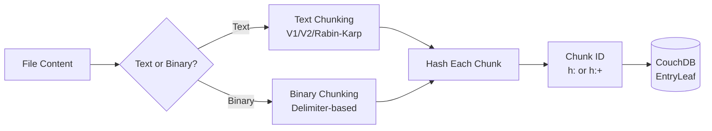
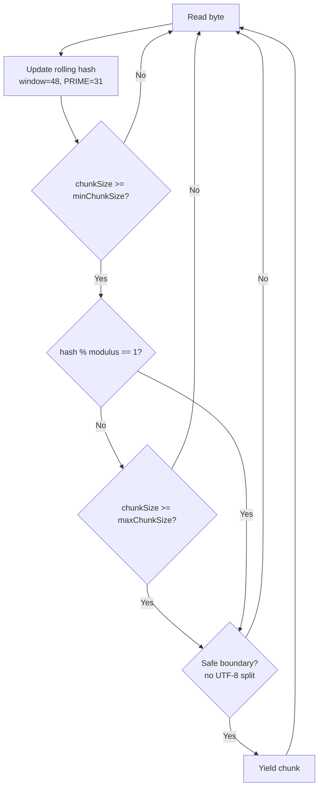

# Chunking

## Overview

Files are split into chunks before storage in CouchDB. This enables:
- Efficient delta sync (only changed chunks are transferred)
- Content deduplication (identical chunks share the same ID)
- CouchDB document size limits compliance (~1MB per document)



## Chunk ID Generation

Chunk IDs are computed by hashing the chunk content. The hash algorithm and whether encryption is enabled determine the format.

Source: `src/lib/src/managers/HashManager/HashManagerCore.ts`, `src/lib/src/managers/HashManager/PureJSHashManager.ts`

### ID Format

| Encryption | Prefix | Full ID Format |
|-----------|--------|---------------|
| Disabled | `h:` | `h:` + hash(content) |
| Enabled | `h:+` | `h:+` + hash(content + hashedPassphrase) |

Source: `src/lib/src/managers/HashManager/HashManagerCore.ts:122-128`

### Hash Algorithms

Configured via `HashAlgorithms` in `src/lib/src/common/models/setting.const.ts:27-33`:

| Algorithm | Constant | Hash Input (no encryption) | Hash Input (with encryption) |
|-----------|----------|---------------------------|------------------------------|
| `mixed-purejs` | `MIXED_PUREJS` | `fallbackMixedHashEach(content + "-" + content.length)` | `fallbackMixedHashEach(content + hashedPassphrase + content.length)` |
| `sha1` | `SHA1` | `sha1(content + "-" + content.length)` | `sha1(content + "-" + hashedPassphrase + "-" + content.length)` |
| `xxhash32` | `XXHASH32` | (obsolete since v0.24.7) | |
| `xxhash64` | `XXHASH64` | | |

Source: `src/lib/src/managers/HashManager/PureJSHashManager.ts:34-45, 77-88`

### Passphrase Hashing for Chunk IDs

The passphrase is preprocessed before use in chunk ID computation:

```
passphraseForHash = SALT_OF_ID + passphrase[0 .. floor(len*3/4)]
hashedPassphrase  = fallbackMixedHashEach(passphraseForHash)
```

Where:
- `SALT_OF_ID = "a83hrf7f\u0003y7sa8g31"` (defined in `shared.const.behabiour.ts:15`)
- `usingLetters = floor(passphrase.length / 4 * 3)` - uses first 3/4 of the passphrase
- `fallbackMixedHashEach` is a pure-JS hash function from `octagonal-wheels/hash/purejs`

Additionally, `hashedPassphrase32` is computed as `mixedHash(passphraseForHash, SEED_MURMURHASH)[0]` where `SEED_MURMURHASH = 0x12345678`.

Source: `src/lib/src/managers/HashManager/HashManagerCore.ts:76-81`, `src/lib/src/common/models/shared.const.behabiour.ts:14-16`

## Text Chunking Algorithms

Text files (`.md`, `.txt`, `.canvas`) use structure-aware chunking. The algorithm is selected via `ChunkAlgorithms`:

```typescript
const ChunkAlgorithms = {
    V1: "v1",
    V2: "v2",
    V2Segmenter: "v2-segmenter",
    RabinKarp: "v3-rabin-karp",
} as const;
```

Source: `src/lib/src/common/models/setting.const.ts:43-48`

### V1: Line-based (`splitPiecesTextV1`)

Source: `src/lib/src/string_and_binary/chunks.ts:213-249`

1. Split content by newlines
2. Use `pickPiece` generator that recognises code blocks (` ``` `)
3. Within code blocks:
   - If content looks like base64 (ends with `=`) or is >2048 chars, yield as single piece
   - Otherwise split by `;,:<` delimiters
4. Outside code blocks:
   - Accumulate lines until buffer reaches `minimumChunkSize`
   - Flush on heading lines (`#`)
5. Final split: enforce `pieceSize` maximum per chunk (with surrogate pair awareness)

### V2: Segmenter-based (`splitPiecesTextV2`)

Source: `src/lib/src/string_and_binary/chunks.ts:140-190`

1. Split content by newlines
2. Track code block state (` ``` ` and ` ```` `)
3. Outside code blocks: use `Intl.Segmenter` (sentence granularity) for splitting, respecting `minimumChunkSize`
4. Inside code blocks: simple fixed-size split
5. Enforce `pieceSize` maximum

### V2 Simple (`splitPieces2V2` for text blobs)

Source: `src/lib/src/string_and_binary/chunks.ts:337-377`

For text blobs, splits by newline delimiter with dynamic minimum chunk size:
- `minimumChunkSize` grows to keep total chunks under 100 (`MAX_ITEMS`)

### V3: Rabin-Karp (`splitPiecesRabinKarp`)

Source: `src/lib/src/string_and_binary/chunks.ts:490-622`

Content-defined chunking using a rolling hash:

**Parameters:**
- `windowSize = 48` bytes
- `PRIME = 31` (hash polynomial base)
- `avgChunkSize = max(minPieceSize, fileSize / splitPieceCount)`
  - Text: `splitPieceCount = 20`, `minPieceSize = 128`
  - Binary: `splitPieceCount = 12`, `minPieceSize = 4096`
- `maxChunkSize = min(absoluteMaxPieceSize, avgChunkSize * 5)`
- `minChunkSize = min(max(avgChunkSize / 4, minimumChunkSize), maxChunkSize)`
- `hashModulus = avgChunkSize`
- `boundaryPattern = 1`

**Algorithm:**
```
For each byte:
  1. Update rolling hash over window of 48 bytes
  2. If currentChunkSize >= minChunkSize AND (hash % hashModulus == boundaryPattern):
     → Boundary candidate
  3. If currentChunkSize >= maxChunkSize:
     → Force boundary
  4. For text: ensure boundary doesn't split multi-byte UTF-8 characters
  5. Yield chunk, reset
```



## Binary Chunking

Source: `src/lib/src/string_and_binary/chunks.ts:431-488` (V1), `src/lib/src/string_and_binary/chunks.ts:337-429` (V2)

Binary files are chunked differently:

1. **Delimiter selection** based on file extension:
   - `.pdf`: delimiter = `/` (`0x2F`)
   - `.json`: delimiter = `,` (`0x2C`), allows smaller chunks
   - All others: delimiter = null byte (`0x00`)

2. **Dynamic `minimumChunkSize`** calculation:
   ```
   clampedSize = clamp(fileSize, clampMin, 100MB)
   step = 1
   w = clampedSize
   while (w > 10): w /= 12.5; step++
   minimumChunkSize = floor(10^(step-1))
   ```
   Where `clampMin` = 100 for JSON, 100000 (100KB) otherwise.

3. **Splitting logic:**
   - Find delimiter or newline after `minimumChunkSize` offset
   - If found before `pieceSize`, split there
   - Otherwise split at `pieceSize`
   - Each chunk is base64-encoded

## Chunk Size Constants

Source: `src/lib/src/common/models/shared.const.behabiour.ts:4-5`

| Constant | Value | Purpose |
|----------|-------|---------|
| `MAX_DOC_SIZE` | `1000` chars | Default piece size for text files |
| `MAX_DOC_SIZE_BIN` | `102400` chars (100KB) | Default piece size for binary files |

## Storage Format

Chunks are stored as `EntryLeaf` documents:

```json
{
    "_id": "h:hashvalue",
    "type": "leaf",
    "data": "chunk content (text or base64)"
}
```

The parent file entry references chunks via the `children` array:

```json
{
    "_id": "path/to/file.md",
    "type": "plain",
    "children": ["h:chunk1hash", "h:chunk2hash", "h:chunk3hash"],
    ...
}
```

To reconstruct a file, fetch all `children` entries in order and concatenate their `data` fields.

### Chunk `data` Encoding

The `data` field in `EntryLeaf` uses one of two encodings for binary content:

| Encoding | Prefix | Description | Status |
|----------|--------|-------------|--------|
| Base64 | (none) | Standard base64 encoding | **Current** |
| Legacy UTF-16 | `%` | Custom UTF-16 byte mapping (see `doc/data-model.md` Binary Data Decoding) | Deprecated |

For text chunks (from `PlainEntry`), the `data` field contains plain text (no encoding).

When encryption is enabled (`e_: true`), the `data` field contains encrypted ciphertext (see `doc/encryption.md`). Encryption is applied **after** the content encoding — decrypt first, then check for `%` prefix to determine base64 vs UTF-16 decoding.
