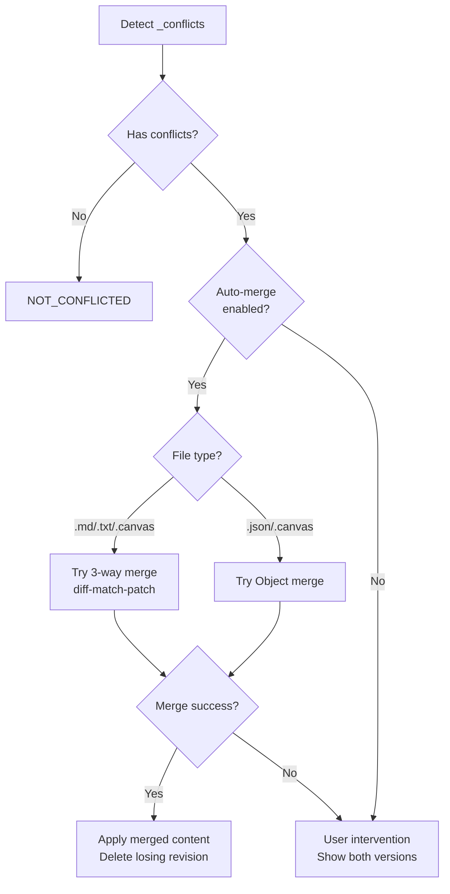
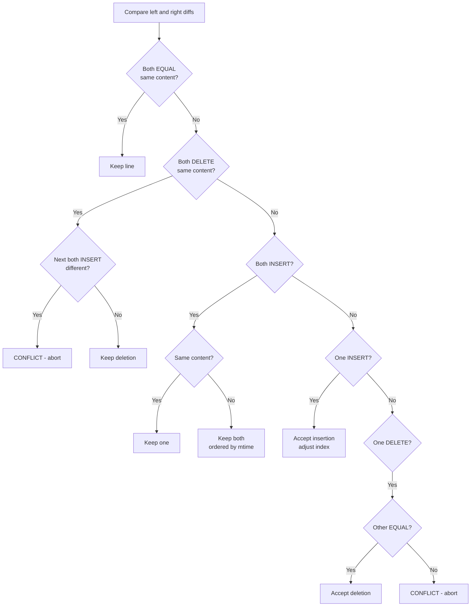

# Conflict Resolution

## Overview

CouchDB uses a multi-master replication model where conflicts are expected. When the same document is modified on multiple devices simultaneously, CouchDB stores all conflicting revisions and picks an arbitrary winner. Obsidian LiveSync implements automatic and manual conflict resolution strategies.

Source: `src/lib/src/managers/ConflictManager.ts`

## Conflict Detection

Conflicts are detected via the PouchDB `_conflicts` field:

```typescript
const doc = await entryManager.getDBEntry(path, {
    conflicts: true,
    revs_info: true
});
if (doc._conflicts && doc._conflicts.length > 0) {
    // Document has conflicts
}
```

Source: `ConflictManager.ts:368-379`

Conflicts are sorted by revision number:
```typescript
const conflicts = test._conflicts.sort(
    (a, b) => Number(a.split("-")[0]) - Number(b.split("-")[0])
);
```

## Resolution Flow



Source: `ConflictManager.ts:367-390`

## Auto-merge Strategies

### 1. Sensible Merge (3-way merge with diff-match-patch)

Applicable to: Files where `isSensibleMargeApplicable(path)` returns true (`.md`, `.txt`, `.canvas`)

Source: `ConflictManager.ts:82-259`

#### Algorithm

1. Find common ancestor revision:
   ```typescript
   const revFrom = await database.get(id, { revs_info: true });
   const commonBase = revFrom._revs_info
       .filter(e => e.status == "available" && Number(e.rev.split("-")[0]) < conflictedRevNo)
       ?.[0]?.rev;
   ```

2. Compute line-level diffs from base to each conflicting revision:
   ```typescript
   const dmp = new diff_match_patch();
   const mapLeft = dmp.diff_linesToChars_(baseData, leftData);
   const diffLeft = dmp.diff_main(mapLeft.chars1, mapLeft.chars2, false);
   dmp.diff_charsToLines_(diffLeft, mapLeft.lineArray);
   // Same for right side
   ```

3. Attempt to merge diffs line-by-line:



4. If all diffs merged without conflict:
   - Reconstruct content from merged diffs (excluding DELETE operations)
   - Save merged content, delete the conflicting revision

### 2. Object Merge (JSON documents)

Applicable to: Files where `isObjectMargeApplicable(path)` returns true (`.json`, `.canvas`)

Source: `ConflictManager.ts:261-325`

#### Algorithm

1. Parse base, left, and right as JSON
2. Generate patch objects:
   ```typescript
   const diffLeft = generatePatchObj(baseObj, leftObj);
   const diffRight = generatePatchObj(baseObj, rightObj);
   ```
3. Flatten both patches to key-value pairs
4. Check for conflicts:
   - Same key modified to **same** value → OK (deduplicate)
   - Same key modified to **different** values → CONFLICT (abort)
5. If no conflicts, apply patches ordered by `mtime`:
   ```typescript
   const patches = [
       { mtime: leftLeaf.mtime, patch: diffLeft },
       { mtime: rightLeaf.mtime, patch: diffRight },
   ].sort((a, b) => a.mtime - b.mtime);
   let newObj = { ...baseObj };
   for (const patch of patches) {
       newObj = applyPatch(newObj, patch.patch);
   }
   ```

## Manual Resolution

When auto-merge fails or is disabled, the user is presented with both versions:

```typescript
return {
    leftRev: test._rev,      // Current winning revision
    rightRev: conflicts[0],   // First conflicting revision
    leftLeaf: leftData,       // Content + metadata of left
    rightLeaf: rightData,     // Content + metadata of right
};
```

Source: `ConflictManager.ts:387-389`

The UI then shows a diff view where the user can choose which version to keep or manually merge.

## Delete Handling

### Soft Delete

A document is marked as logically deleted by setting `deleted: true` in the document body. The document still exists in CouchDB and participates in replication.

```json
{
    "_id": "path/to/file.md",
    "type": "plain",
    "deleted": true,
    "mtime": 1700000000000,
    ...
}
```

### Hard Delete

CouchDB's native deletion via `_deleted: true`. The document becomes a "tombstone" - only `_id`, `_rev`, and `_deleted` fields are retained.

### Conflict with Deletions

Source: `ConflictManager.ts:92-98, 279`

During merge, if both revisions are deleted, the merge is skipped (both agree on deletion):

```typescript
if (leftLeaf.deleted && rightLeaf.deleted) {
    return false; // Both deleted, nothing to merge
}
```

A deleted revision merged against a live revision results in the live content being preserved (deletion is treated as removing all content).
