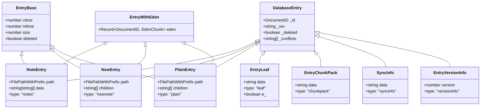
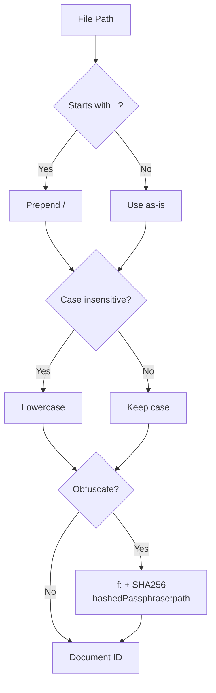

# Data Model

## Document Types

All documents in the CouchDB database have a `type` field that determines their structure.

### EntryTypes

Defined in `src/lib/src/common/models/db.const.ts:9-21`:

```typescript
export const EntryTypes = {
    NOTE_LEGACY: "notes",       // Legacy inline note (data stored directly)
    NOTE_BINARY: "newnote",     // Binary/new note (data stored as chunks)
    NOTE_PLAIN: "plain",        // Plain text note (data stored as chunks)
    INTERNAL_FILE: "internalfile",
    CHUNK: "leaf",              // Individual chunk of content
    CHUNK_PACK: "chunkpack",    // Packed chunks (batch)
    VERSION_INFO: "versioninfo",
    SYNC_INFO: "syncinfo",
    SYNC_PARAMETERS: "sync-parameters",
    MILESTONE_INFO: "milestoneinfo",
    NODE_INFO: "nodeinfo",
} as const;
```

### Document Type Hierarchy



Source: `src/lib/src/common/models/db.type.ts`

### File Entry Documents

#### NoteEntry (`type: "notes"`) - Legacy

Stores file content directly in the `data` field. Only used for backward compatibility.

```json
{
    "_id": "path/to/file.md",
    "type": "notes",
    "path": "path/to/file.md",
    "data": "file content as string or array of strings",
    "ctime": 1700000000000,
    "mtime": 1700000000000,
    "size": 1234,
    "eden": {}
}
```

#### NewEntry (`type: "newnote"`) - Binary Files

Stores binary files (images, PDFs, etc.) as references to chunk IDs.

```json
{
    "_id": "path/to/image.png",
    "type": "newnote",
    "path": "path/to/image.png",
    "children": ["h:abc123", "h:def456"],
    "ctime": 1700000000000,
    "mtime": 1700000000000,
    "size": 102400,
    "eden": {}
}
```

#### PlainEntry (`type: "plain"`) - Text Files

Stores text files as references to chunk IDs (chunked for efficient diff).

```json
{
    "_id": "path/to/file.md",
    "type": "plain",
    "path": "path/to/file.md",
    "children": ["h:abc123", "h:def456"],
    "ctime": 1700000000000,
    "mtime": 1700000000000,
    "size": 5678,
    "eden": {}
}
```

### Chunk Documents

#### EntryLeaf (`type: "leaf"`)

Individual chunk of file content.

```json
{
    "_id": "h:abc123def456",
    "type": "leaf",
    "data": "chunk content (text or base64-encoded binary)"
}
```

When encrypted, the `e_` flag is set:

```json
{
    "_id": "h:+abc123def456",
    "type": "leaf",
    "data": "%=base64_encrypted_data...",
    "e_": true
}
```

#### EntryChunkPack (`type: "chunkpack"`)

Batch of multiple chunks packed together.

```json
{
    "_id": "chunkpack_id",
    "type": "chunkpack",
    "data": "packed chunk data as string"
}
```

### System Documents

#### Version Info

```json
{
    "_id": "obsydian_livesync_version",
    "type": "versioninfo",
    "version": 12
}
```

Note: The `_id` uses the historical typo "obsydian" (not "obsidian").

#### SyncInfo

```json
{
    "_id": "syncinfo",
    "type": "syncinfo",
    "data": "JSON string with sync metadata"
}
```

#### Sync Parameters (Local Document)

Stored as a CouchDB local document (not replicated via normal replication).

```json
{
    "_id": "_local/obsidian_livesync_sync_parameters",
    "type": "sync-parameters",
    "protocolVersion": 2,
    "pbkdf2salt": "base64_encoded_32_byte_salt"
}
```

Source: `src/lib/src/common/models/sync.definition.ts:10-25`

#### Milestone (Local Document)

Used for version compatibility checking between devices.

```json
{
    "_id": "_local/obsydian_livesync_milestone",
    "type": "milestoneinfo"
}
```

#### Node Info (Local Document)

Identifies a specific device/node.

```json
{
    "_id": "_local/obsydian_livesync_nodeinfo",
    "type": "nodeinfo"
}
```

Source: `src/lib/src/common/models/db.const.ts:3-5`

## Special Document IDs

| Constant | Value | Purpose |
|----------|-------|---------|
| `VERSIONING_DOCID` | `obsydian_livesync_version` | DB schema version tracking |
| `MILESTONE_DOCID` | `_local/obsydian_livesync_milestone` | Device compatibility check |
| `NODEINFO_DOCID` | `_local/obsydian_livesync_nodeinfo` | Node identification |
| `SYNCINFO_ID` | `syncinfo` | Sync metadata |
| `DOCID_SYNC_PARAMETERS` | `_local/obsidian_livesync_sync_parameters` | PBKDF2 salt storage |

Source: `src/lib/src/common/models/db.const.ts:3-7`, `src/lib/src/common/models/sync.definition.ts:10`

## ID Prefixes

Defined in `src/lib/src/common/models/shared.const.behabiour.ts:18-22`:

| Prefix | Constant | Purpose |
|--------|----------|---------|
| `h:` | `IDPrefixes.Chunk` | Normal chunk ID |
| `h:+` | `IDPrefixes.EncryptedChunk` | Encrypted chunk ID |
| `f:` | `IDPrefixes.Obfuscated` | Obfuscated (hashed) file path |

## File Path to Document ID Conversion

Source: `src/lib/src/string_and_binary/path.ts:98-125`

### Rules

1. **Normal mode**: File path is used directly as `_id`
   - Exception: Paths starting with `_` get a `/` prefix (CouchDB reserves `_` prefix)
   - Example: `_config/test.md` becomes `/_config/test.md`

2. **Case-insensitive mode** (`caseInsensitive: true`): Path is lowercased before use as `_id`

3. **Obfuscation mode** (`obfuscatePassphrase` is set):
   - Path is hashed using SHA-256
   - Format: `f:` + SHA-256(hashedPassphrase + `:` + filename)
   - The `hashedPassphrase` is itself computed as SHA-256 of the obfuscation passphrase (with stretching equal to passphrase length)



### Reverse Mapping (ID to Path)

- Normal documents: Remove leading `/` if present; otherwise `_id` is the path
- Obfuscated documents (`f:` prefix): Path must be recovered from the `path` field in the entry (requires decryption if E2EE is enabled)

Source: `src/lib/src/string_and_binary/path.ts:127-138`

## Text vs Binary Classification

A file is classified as plain text based on its extension. All other files are treated as binary.

Source: `src/lib/src/string_and_binary/path.ts:179-190`

**Text extensions:** `.md`, `.txt`, `.svg`, `.html`, `.csv`, `.css`, `.js`, `.xml`, `.canvas`

**Plain-split extensions** (line-aware chunking): `.md`, `.txt`, `.canvas`

Source: `src/lib/src/string_and_binary/path.ts:191-196`

## Eden Field

The `eden` field is a `Record<DocumentID, EdenChunk>` present on file entries. It stores auxiliary metadata that can be updated independently of the main document content.

```typescript
type EdenChunk = {
    data: string;    // Content or encrypted content
    epoch: number;   // Version counter
};
```

When E2EE is enabled, the entire eden object is encrypted under the key `h:++encrypted-hkdf` (V2) or `h:++encrypted` (V1).

Source: `src/lib/src/common/models/db.type.ts:61-68`, `src/lib/src/pouchdb/encryption.ts:495-496`

## NoteEntry `data` Field Reconstruction

The `data` field of `NoteEntry` (type `"notes"`) can be either `string` or `string[]`.

### Joining Rule

When `data` is `string[]`, concatenate all elements with **empty string** (no separator):

```
if typeof data === "string":
    content = data
else:
    content = data.join("")    // ["chunk1", "chunk2"] → "chunk1chunk2"
```

This applies to the legacy `NoteEntry` only. For `NewEntry`/`PlainEntry`, content is reconstructed by fetching chunks referenced in `children`.

## Binary Data Decoding (`decodeBinary`)

Source: `node_modules/octagonal-wheels/dist/binary/index.js:33-48`

The `decodeBinary()` function converts chunk `data` (from `EntryLeaf`) into an `ArrayBuffer` for binary files. It handles two encodings:

### Dispatch Logic

```
function decodeBinary(src: string | string[]):
    if src.length == 0 → empty ArrayBuffer
    if typeof src === "string":
        if src[0] === "%" → _decodeToArrayBuffer(src.substring(1))   // legacy UTF-16
        else              → base64ToArrayBuffer(src)                  // standard base64
    else (string[]):
        if src[0][0] === "%" → decodeToArrayBuffer([src[0].substring(1), ...rest])  // legacy UTF-16
        else                 → base64ToArrayBuffer(src)               // standard base64
```

### Legacy UTF-16 Encoding (`%` prefix in non-encrypted chunks)

Source: `node_modules/octagonal-wheels/dist/binary/encodedUTF16.js`

This is **separate from encryption**. The `%` prefix in `decodeBinary()` indicates legacy UTF-16 encoded binary data (used before base64 encoding was adopted). It only applies to chunks where `e_` is **not** set (non-encrypted data).

The encoding maps byte values to Unicode code points in the range `0xC0..0x1BF`, except for ASCII characters `0x26..0x7E` (excluding `0x3A` = `:`) which are kept as-is.

Decoding:
```
for each character in string:
    charCode = character.charCodeAt(0)
    if charCode >= 0x26 && charCode <= 0x7E && charCode != 0x3A:
        byte = charCode           // ASCII pass-through
    else:
        byte = reverseTable[charCode]  // map back from 0xC0..0x1BF range
```

**Go implementation note:** When processing non-encrypted chunk data, check the first character for `%`. If present, strip it and apply UTF-16 reverse-mapping decoding. Otherwise, use standard base64 decoding.

## ChunkVersionRange

Used in milestone documents to track chunk format compatibility between devices.

```typescript
interface ChunkVersionRange {
    min: number;     // Minimum compatible chunk format version
    max: number;     // Maximum compatible chunk format version
    current: number; // Current chunk version
}
```

Current values: `{ min: 0, max: 2400, current: 2 }`

Source: `src/lib/src/common/models/db.type.ts:162-166`, `src/lib/src/replication/couchdb/LiveSyncReplicator.ts:60-64`
