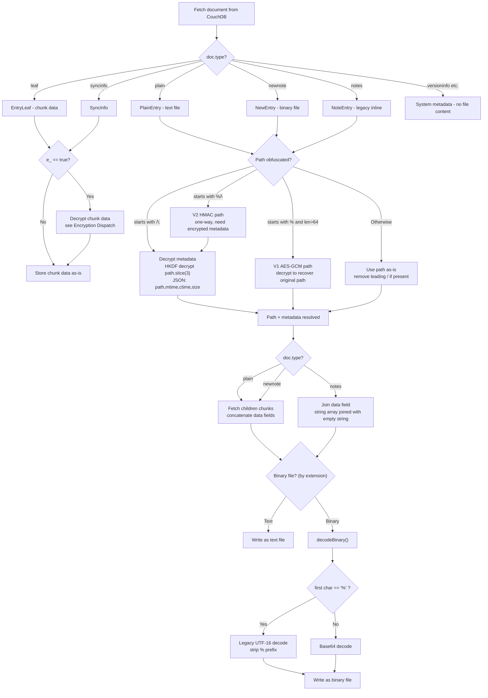

# Decoding Guide for Go Implementation

This document describes the complete flow for decoding CouchDB documents pulled from the remote database into local files. It covers all format variants that may exist in the database.

## End-to-End Decoding Flow



## Step 1: Document Type Dispatch

Fetch a document from CouchDB and check its `type` field:

| Type | Action |
|------|--------|
| `"leaf"` | Chunk data — may need decryption |
| `"plain"` | Text file entry — fetch chunks from `children` |
| `"newnote"` | Binary file entry — fetch chunks from `children` |
| `"notes"` | Legacy inline entry — content in `data` field |
| `"syncinfo"` | Sync metadata — may need decryption |
| `"versioninfo"`, `"milestoneinfo"`, `"nodeinfo"` | System metadata — no file content |

## Step 2: Chunk Decryption

For `EntryLeaf` documents (and `syncinfo`), check the `e_` flag:

- `e_` is absent or `false` → data is plaintext (or base64/UTF-16 encoded binary)
- `e_` is `true` → data is encrypted, dispatch by prefix:

```
if data.startsWith("%="):     → HKDF decrypt (V2 current)
elif data.startsWith("%$"):   → HKDF Ephemeral decrypt (salt embedded)
elif data.startsWith("%~"):   → V3 decrypt (fixed salt PBKDF2)
elif data.startsWith("%"):    → V1-Hex decrypt (random salt PBKDF2)
elif data.startsWith("["):    → V1-JSON decrypt (parse JSON array)
else:                         → error (unknown format)
```

See `doc/encryption.md` for detailed key derivation and format specifications for each variant.

## Step 3: Path Resolution

File entry documents (`plain`, `newnote`, `notes`) have a `path` field that may be obfuscated:

```
if path.startsWith("/\\:"):
    // HKDF-encrypted metadata
    encrypted = path[3:]                    // strip "/\:" prefix
    json = decryptHKDF(encrypted)           // standard HKDF decrypt (%=...)
    props = JSON.parse(json)                // {path, mtime, ctime, size, children?}
    → use props.path as the real file path
    → use props.mtime, props.ctime, props.size for file metadata

elif path.startsWith("%/\\"):
    // V2 HMAC path (one-way) — real path is in encrypted metadata
    // The document MUST also have /\: metadata to recover the real path
    → look for encrypted metadata in the same document

elif path.startsWith("%") && path.length > 64:
    // V1 AES-GCM encrypted path — can be decrypted
    → decrypt using V1 obfuscatePath key derivation

else:
    // Plain path
    if path.startsWith("/"):
        realPath = path[1:]                 // remove CouchDB safety prefix
    else:
        realPath = path
```

## Step 4: Content Reconstruction

### For `PlainEntry` / `NewEntry` (chunked files)

1. Read the `children` array (list of chunk IDs like `"h:abc123"`)
2. Fetch each chunk document from the database
3. Decrypt each chunk if `e_: true` (Step 2)
4. Concatenate all chunk `data` fields **in order**

### For `NoteEntry` (legacy inline)

1. Read the `data` field
2. If `data` is `string[]`, join with empty string: `data.join("")`
3. If `data` is `string`, use as-is

### Eden Field

If the document has an `eden` field with encrypted content:
- Key `h:++encrypted-hkdf` → HKDF-encrypted JSON (decrypt, then `JSON.parse`)
- Key `h:++encrypted` → V1-encrypted JSON

## Step 5: Binary Decoding

After content reconstruction, binary files need one more decoding step:

```
function decodeBinary(data: string | string[]):
    if data is string[]:
        check data[0][0] for prefix
    else:
        check data[0] for prefix

    if first char == '%':
        → Legacy UTF-16 decoding (strip '%', apply reverse char mapping)
    else:
        → Standard base64 decoding
```

**Text extensions** (no binary decoding needed): `.md`, `.txt`, `.svg`, `.html`, `.csv`, `.css`, `.js`, `.xml`, `.canvas`

All other extensions are treated as binary and require `decodeBinary()`.

See `doc/data-model.md` for the UTF-16 reverse-mapping table details.

## Required Keys and Parameters

To decode all possible formats, a Go implementation needs:

| Parameter | Source | Used For |
|-----------|--------|----------|
| `passphrase` | User configuration | All encryption/decryption |
| `pbkdf2Salt` | `_local/obsidian_livesync_sync_parameters` → `pbkdf2salt` (base64) | HKDF key derivation, V2 path obfuscation |
| `useDynamicIterationCount` | User configuration | V1 encryption iteration count |

## Quick Reference: All Prefix Patterns

| Context | Prefix | Meaning | Reference |
|---------|--------|---------|-----------|
| Encrypted chunk data | `%=` | HKDF encryption | `doc/encryption.md` |
| Encrypted chunk data | `%$` | HKDF with ephemeral salt | `doc/encryption.md` |
| Encrypted chunk data | `%~` | V3 encryption (deprecated) | `doc/encryption.md` |
| Encrypted chunk data | `%` (other) | V1-Hex encryption | `doc/encryption.md` |
| Encrypted chunk data | `[...` | V1-JSON encryption | `doc/encryption.md` |
| Document path | `/\:` | HKDF-encrypted metadata | `doc/encryption.md` |
| Document path | `%/\` | V2 HMAC obfuscated path | `doc/encryption.md` |
| Document path | `%` + len>64 | V1 AES-GCM obfuscated path | `doc/encryption.md` |
| Chunk ID | `h:` | Normal chunk | `doc/data-model.md` |
| Chunk ID | `h:+` | Encrypted chunk | `doc/data-model.md` |
| Document ID | `f:` | Obfuscated file entry | `doc/data-model.md` |
| Binary chunk data | `%` (no `e_`) | Legacy UTF-16 encoding | `doc/data-model.md` |
