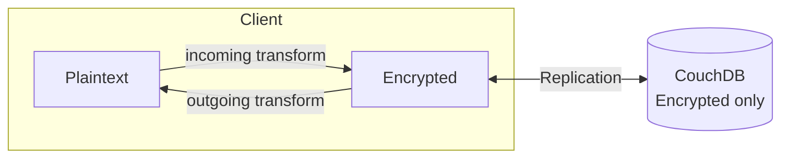
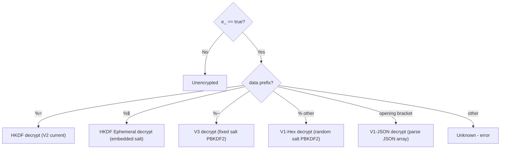
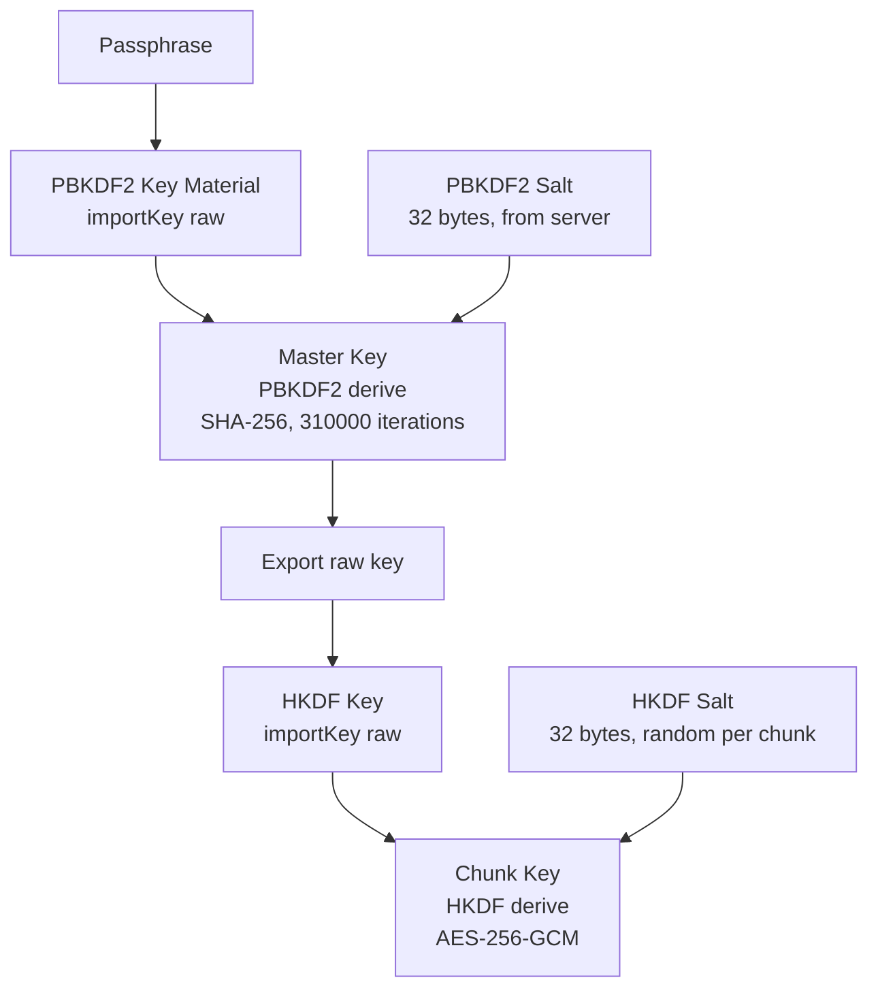

# End-to-End Encryption (E2EE)

## Overview

Obsidian LiveSync supports E2EE to ensure that the CouchDB server only stores encrypted data. All encryption/decryption happens client-side via the PouchDB transform layer.



## Algorithm Versions

Source: `src/lib/src/common/models/setting.const.ts:16-25`

```typescript
const E2EEAlgorithms = {
    V1: "",           // Legacy PBKDF2-based
    V2: "v2",         // HKDF-based (default since v0.25.0)
    ForceV1: "forceV1", // Force legacy (not recommended)
};
```

## All Encryption Formats Summary

The remote database may contain data encrypted with **any** of the following formats. A decoder must handle all of them.

| Prefix | Name | Key Derivation | Wire Format | Status |
|--------|------|---------------|-------------|--------|
| `[...` | V1-JSON | PBKDF2(SHA256(pass), randomSalt, iter) | JSON array `["base64","ivHex","saltHex"]` | Deprecated (oldest) |
| `%` (not `=`,`~`,`$`) | V1-Hex | Same as V1-JSON | `%<IV hex 32><Salt hex 32><base64 ciphertext>` | Deprecated |
| `%~` | V3 | PBKDF2(pass, SHA256(pass+fixedSalt)[0:16], 100000) | `%~<IV hex 24><base64 ciphertext>` | Deprecated |
| `%=` | HKDF | PBKDF2 → HKDF → AES-GCM | `%=<base64(IV+hkdfSalt+cipher)>` | **Current** |
| `%$` | HKDF-Ephemeral | Same as HKDF (salt embedded) | `%$<base64(pbkdf2Salt+IV+hkdfSalt+cipher)>` | Current |

### Detection Logic

Source: `src/lib/src/pouchdb/encryption.ts:35-45`

The top-level dispatcher checks the `e_` flag and prefix:

```typescript
function getEncryptionVersion(data: EntryLeaf): EncryptionVersion {
    if ("e_" in data && data.e_ === true) {
        if (data.data.startsWith("%="))  → HKDF (V2)
        else if (data.data.startsWith("%"))  → ENCRYPTED (V1 family)
        else → UNKNOWN
    }
    return UNENCRYPTED;
}
```

When `ENCRYPTED` (V1 family), the V1 `decrypt()` function further dispatches by prefix:

Source: `node_modules/octagonal-wheels/dist/encryption/encryption.js:217-253`

```
if data[0] == "%":
    if data[1] == "~"  → decryptV3()    // V3 format
    else               → decryptV2()    // V1-Hex format
else if data starts with "[" and ends with "]":
    → V1-JSON format (parse JSON array)
```

**Important for Go decoders:** The `%` prefix in `getEncryptionVersion` matches V1-Hex, V3 (`%~`), and even `%$` (ephemeral). The sub-dispatch inside V1's `decrypt()` handles V3. However, `%=` and `%$` are handled by the HKDF code path, not V1's `decrypt()`.



## V2: HKDF Encryption (Current)

Source: `node_modules/octagonal-wheels/dist/encryption/hkdf.js`

### Key Derivation



#### Step-by-step:

1. **PBKDF2 Salt** (32 bytes): Stored in `_local/obsidian_livesync_sync_parameters` as base64
   - Generated once per vault, shared across all devices
   - Source: `src/lib/src/replication/SyncParamsHandler.ts:109-124`

2. **Master Key derivation:**
   ```
   keyMaterial = importKey("raw", encode(passphrase), "PBKDF2")
   masterKeyRaw = deriveKey({
       name: "PBKDF2",
       salt: pbkdf2Salt,           // 32 bytes from server
       iterations: 310000,          // OWASP recommendation
       hash: "SHA-256"
   }, keyMaterial, {name: "AES-GCM", length: 256})
   masterKeyBuffer = exportKey("raw", masterKeyRaw)
   hkdfKey = importKey("raw", masterKeyBuffer, "HKDF")
   ```
   Source: `hkdf.js:56-82`

3. **Chunk Key derivation** (per-chunk):
   ```
   chunkKey = deriveKey({
       name: "HKDF",
       salt: hkdfSalt,             // 32 bytes, random per encryption
       info: new Uint8Array(),     // empty
       hash: "SHA-256"
   }, hkdfKey, {name: "AES-GCM", length: 256})
   ```
   Source: `hkdf.js:90-102`

4. **Encryption:**
   ```
   iv = randomBytes(12)            // 12-byte IV for AES-GCM
   ciphertext = AES-GCM-Encrypt(chunkKey, iv, plaintext, tagLength=128)
   ```

### Binary Format

```
| IV (12 bytes) | HKDF Salt (32 bytes) | Ciphertext + GCM Tag |
```

### String Format

```
%=<base64(IV | HKDF Salt | Ciphertext + GCM Tag)>
```

### Constants

Source: `hkdf.js:22-38`

| Constant | Value |
|----------|-------|
| `IV_LENGTH` | 12 bytes |
| `PBKDF2_ITERATIONS` | 310000 |
| `HKDF_SALT_LENGTH` | 32 bytes |
| `PBKDF2_SALT_LENGTH` | 32 bytes |
| `gcmTagLength` | 128 bits |
| `HKDF_ENCRYPTED_PREFIX` | `%=` |

## Ephemeral Salt Encryption (`%$`)

Source: `hkdf.js:265-336`

A variant where the PBKDF2 salt is embedded in the encrypted data itself, used for standalone encryption where no shared salt storage is available.

### Binary Format

```
| PBKDF2 Salt (32) | IV (12) | HKDF Salt (32) | Ciphertext + Tag |
```

### String Format

```
%$<base64(above)>
```

### Decoding

1. Base64-decode the data after `%$` prefix
2. Extract: `pbkdf2Salt = bytes[0:32]`, `iv = bytes[32:44]`, `hkdfSalt = bytes[44:76]`, `ciphertext = bytes[76:]`
3. Derive master key using PBKDF2 with the extracted `pbkdf2Salt` (same as V2)
4. Derive chunk key using HKDF with the extracted `hkdfSalt` (same as V2)
5. Decrypt with AES-GCM using the extracted `iv`

## V3: Legacy Encryption (Deprecated)

Source: `node_modules/octagonal-wheels/dist/encryption/encryptionv3.js`

V3 is a deprecated intermediate format that may still exist in remote databases. It uses a **fixed salt** derived from the passphrase, unlike V1 which uses a random salt per encryption.

### Key Derivation

```
passphraseBin = encode(passphrase)
digestOfPassphrase = SHA-256(passphraseBin + "fancySyncForYou!")   // fixed salt string
salt = digestOfPassphrase[0:16]                                    // first 16 bytes
baseKey = importKey("raw", passphraseBin, "PBKDF2")
key = deriveKey({
    name: "PBKDF2",
    salt: salt,
    iterations: 100000,       // fixed, not dynamic
    hash: "SHA-256"
}, baseKey, {name: "AES-GCM", length: 256})
```

Source: `encryptionv3.js:43-59`

**Key differences from V1:**
- Salt is **deterministic** (derived from `SHA-256(passphrase + "fancySyncForYou!")[0:16]`)
- Key input is the raw passphrase bytes, not `SHA-256(passphrase)` like V1
- Iteration count is always 100000 (not dynamic)

### IV Generation

- 12 bytes total: 8 bytes random + 4 bytes counter (Uint32)
- Counter increments per encryption, resets with new random bytes every 1500 encryptions
- Source: `encryptionv3.js:13-35`

### String Format

```
%~<IV hex 24 chars><base64 ciphertext>
```

- `%~` — 2-char prefix
- IV hex — 24 hex characters (12 bytes)
- Remaining — base64-encoded AES-GCM ciphertext with tag

### Decoding

```
ivHex = data[2:26]           // 24 hex chars → 12 bytes
cipherB64 = data[26:]        // rest is base64
iv = hexDecode(ivHex)
ciphertext = base64Decode(cipherB64)
plaintext = AES-GCM-Decrypt(key, iv, ciphertext)
result = readString(plaintext)   // UTF-8 decode from writeString format
```

Source: `encryptionv3.js:98-111`

## V1: Legacy Encryption

Source: `node_modules/octagonal-wheels/dist/encryption/encryption.js`

### Key Derivation

```
passphraseBin = encode(passphrase)
digest = SHA-256(passphraseBin)
keyMaterial = importKey("raw", digest, "PBKDF2")
salt = randomBytes(16)
key = deriveKey({
    name: "PBKDF2",
    salt: salt,
    iterations: iteration,
    hash: "SHA-256"
}, keyMaterial, {name: "AES-GCM", length: 256})
```

**Dynamic iteration count** (`autoCalculateIterations`):
```
passphraseLen = 15 - passphrase.length
iteration = max(0, passphraseLen) * 1000 + 121 - passphraseLen
```
When disabled: `iteration = 100000`

Source: `encryption.js:24-55`

### V1-Hex Format

```
%<IV hex 32 chars><Salt hex 32 chars><base64 ciphertext>
```

Decoding:
```
ivHex = data[1:33]           // 32 hex chars → 16 bytes
saltHex = data[33:65]        // 32 hex chars → 16 bytes
cipherB64 = data[65:]        // rest is base64
```

Source: `encryption.js:166-207`

### V1-JSON Format (oldest)

```
["<base64 ciphertext>","<IV hex>","<Salt hex>"]
```

Decoding:
```
Parse as JSON array of 3 strings
encryptedData = array[0]     // base64 ciphertext
ivHex = array[1]             // hex IV
saltHex = array[2]           // hex salt
```

The decrypted plaintext is then `JSON.parse()`'d (V1-JSON wraps the content in an additional JSON serialisation).

Source: `encryption.js:217-253`

## Path Obfuscation

When path obfuscation is enabled, file paths in document IDs are replaced with hashed/encrypted values using the `f:` prefix. Two versions exist.

### V1: AES-GCM Path Encryption

Source: `node_modules/octagonal-wheels/dist/encryption/obfuscatePath.js`

**Deterministic** encryption — the same path always produces the same ciphertext because salt and IV are derived from the path content.

#### Format

```
%<IV hex 32 chars><Salt hex 32 chars><base64 ciphertext>
```

#### Key Derivation

```
digest = SHA-256(passphraseBin)
buf2 = SHA-256(dataBuf + passphraseBin)   // dataBuf = writeString(path)
salt = buf2[0:16]
iv = buf2[16:32]
keyMaterial = importKey("raw", digest, "PBKDF2")
key = deriveKey({
    name: "PBKDF2",
    salt: salt,
    iterations: iteration,     // same dynamic calculation as V1 encryption
    hash: "SHA-256"
}, keyMaterial, {name: "AES-GCM", length: 256})
```

Source: `obfuscatePath.js:40-57`

#### Detection

```
isPathProbablyObfuscated(path) = path.startsWith("%") && path.length > 64
```

Source: `obfuscatePath.js:30-32`

#### Decoding

V1 obfuscated paths **can be decrypted** back to the original path using the same key derivation. The path field in the document stores the encrypted path, and decryption recovers the original filename.

### V2: HMAC Path Hashing (One-way)

Source: `node_modules/octagonal-wheels/dist/encryption/obfuscatePathV2.js`

V2 uses HMAC-SHA256, making the obfuscation **one-way** (cannot recover the original path from the hash alone). The original path must be retrieved from the encrypted metadata (`/\:` prefix).

#### Format

```
%/\<base64 HMAC>
```

- Prefix: `%/\` — contains both `\` (invalid on Windows) and `/` (invalid on Mac/Linux), ensuring no collision with real filenames on any OS
- Body: base64-encoded HMAC-SHA256 output

#### Key Derivation

```
passphraseBin = writeString(passphrase)
keyMaterial = importKey("raw", passphraseBin, "HKDF")
derivedKey = deriveKey({
    name: "HKDF",
    hash: "SHA-256",
    salt: hkdfSalt,              // PBKDF2 salt from sync parameters
    info: new Uint8Array([]),    // empty
}, keyMaterial, {name: "HMAC", hash: "SHA-256", length: 256})
hmac = sign("HMAC", derivedKey, writeString(path))
result = "%/\" + base64(hmac)
```

Source: `obfuscatePathV2.js:31-77`

#### Detection

```
isPathProbablyObfuscatedV2(path) = path.startsWith("%/\\")
```

Source: `obfuscatePathV2.js:19-22`

#### Decoding

V2 obfuscated paths **cannot be decrypted**. The original path is stored in the HKDF-encrypted metadata (see next section).

### Path Obfuscation Detection Summary

When reading a `path` field from a document:

| Condition | Interpretation |
|-----------|---------------|
| `path.startsWith("%/\\")` | V2 obfuscation — path in encrypted metadata |
| `path.startsWith("%") && path.length > 64` | V1 obfuscation — decrypt with AES-GCM |
| `path.startsWith("/\\:")` | HKDF-encrypted metadata (not a real path) |
| Otherwise | Plain path |

## Encrypted Metadata (`/\:` prefix)

Source: `src/lib/src/pouchdb/encryption.ts:74-117`

When path obfuscation is enabled with HKDF (V2), the document's metadata fields are encrypted into the `path` field:

### Encryption

```
props = {
    path: originalPath,
    mtime: originalMtime,
    ctime: originalCtime,
    size: originalSize,
    children: originalChildren   // only for MetaEntry
}
doc.path = "/\:" + encryptHKDF(JSON.stringify(props))
doc.mtime = 0
doc.ctime = 0
doc.size = 0
doc.children = []               // cleared
```

### Decryption

1. Check: `path.startsWith("/\\:")`
2. Extract encrypted part: `encryptedMeta = path.slice(3)`
3. The encrypted part starts with `%=` (HKDF format) — decrypt using standard HKDF decryption
4. Parse result as JSON: `{path, mtime, ctime, size, children?}`
5. Overwrite the document fields with the decrypted values

```
encryptedMeta = doc.path.slice(3)      // remove "/\:" prefix
jsonStr = decryptHKDF(encryptedMeta)   // standard HKDF decrypt (%=...)
props = JSON.parse(jsonStr)            // → {path, mtime, ctime, size, children?}
doc.path = props.path
doc.mtime = props.mtime
doc.ctime = props.ctime
doc.size = props.size
if (props.children) doc.children = props.children
```

## Encryption Targets

### 1. Chunk Data (`EntryLeaf.data`)

When a chunk has `e_: true`, its `data` field is encrypted.

- **Incoming** (write): Encrypt `data` field, set `e_ = true`
- **Outgoing** (read): Decrypt `data` field, remove `e_`

Source: `src/lib/src/pouchdb/encryption.ts:125-162` (HKDF), `src/lib/src/pouchdb/encryption.ts:320-367` (V1)

### 2. File Metadata (Obfuscated Entries)

When path obfuscation is enabled (entries with `f:` prefix), metadata is encrypted:

**HKDF (V2):**
```
path = "/\:" + encryptHKDF(JSON.stringify({
    path: originalPath,
    mtime: originalMtime,
    ctime: originalCtime,
    size: originalSize,
    children: originalChildren  // if MetaEntry
}))
mtime = 0
ctime = 0
size = 0
children = []  // cleared
```

The prefix `"/\:"` (`ENCRYPTED_META_PREFIX`) indicates HKDF-encrypted metadata.

Source: `src/lib/src/pouchdb/encryption.ts:74-104`

**V1:**
Path is encrypted using `obfuscatePath()` from octagonal-wheels.

Source: `src/lib/src/pouchdb/encryption.ts:350-365`

### 3. Eden Field

The entire `eden` record is encrypted and stored under a single key:

| Version | Key | Format |
|---------|-----|--------|
| V1 | `h:++encrypted` | `encrypt(JSON.stringify(eden))` |
| V2 (HKDF) | `h:++encrypted-hkdf` | `encryptHKDF(JSON.stringify(eden))` |

When encrypting, the original eden is replaced:
```json
{
    "eden": {
        "h:++encrypted-hkdf": {
            "data": "%=encrypted_json...",
            "epoch": 999999
        }
    }
}
```

Source: `src/lib/src/pouchdb/encryption.ts:164-180, 495-496`

### 4. SyncInfo Document

The `syncinfo` document's `data` field is encrypted in the same way as chunk data (detected by `isSyncInfoEntry()`).

## PouchDB Transform

Source: `src/lib/src/pouchdb/encryption.ts:458-484`

```typescript
enableEncryption(db, passphrase, useDynamicIterationCount, migrationDecrypt, getPBKDF2Salt, algorithm)
```

Installs a `transform-pouch` transform on the PouchDB instance:

- **`incoming`** (before write to DB):
  - V2: `incomingEncryptHKDF` - Encrypts chunks, eden, and obfuscated metadata
  - V1: `incomingEncryptV1` - Legacy encryption

- **`outgoing`** (after read from DB):
  - V2/V1: `outgoingDecryptHKDF` - Decrypts HKDF first, falls back to V1 for migration
  - ForceV1: `outgoingDecryptV1` - Only V1 decryption

The same incoming function is also exported as `preprocessOutgoing` for use during chunk bulk-sending before replication:

```typescript
export let preprocessOutgoing: (doc) => Promise<doc>;
```

Source: `src/lib/src/pouchdb/encryption.ts:451-456`

## V1 to V2 Migration

When `algorithm = V2` and a V1-encrypted document is encountered during decryption:

1. Decrypt with V1
2. On next write (incoming), re-encrypt with HKDF
3. The `e_` flag is preserved

This enables transparent migration without requiring a full re-encryption step.

Source: `src/lib/src/pouchdb/encryption.ts:138-148`
