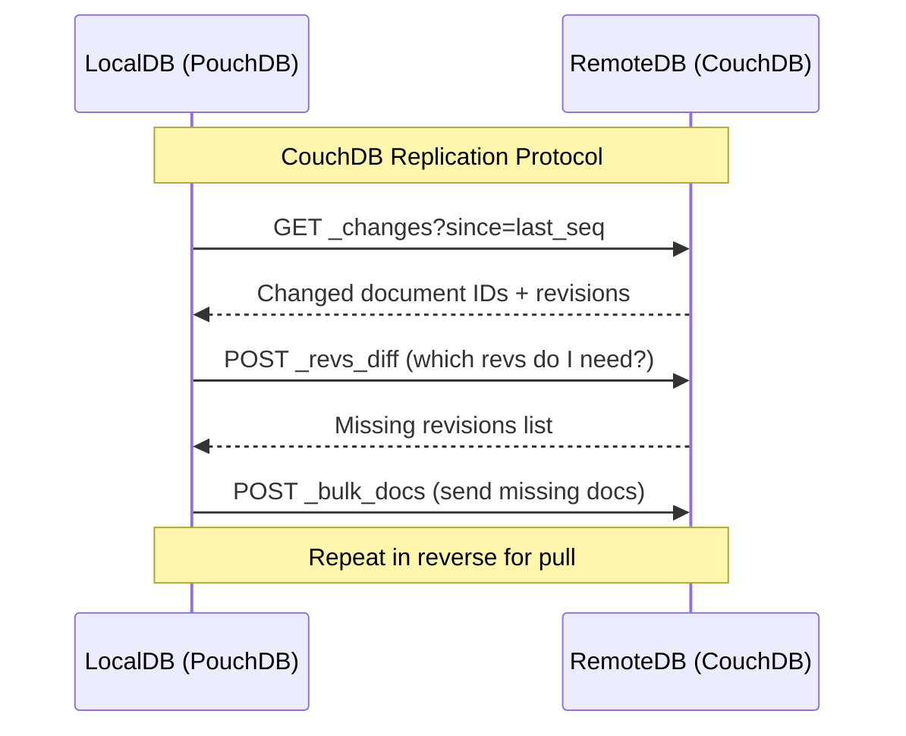
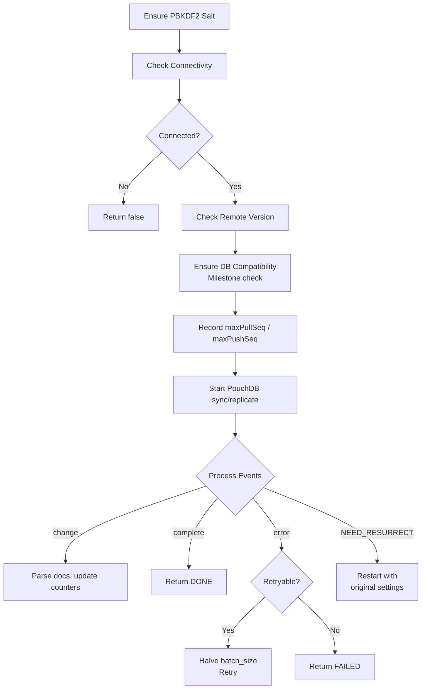
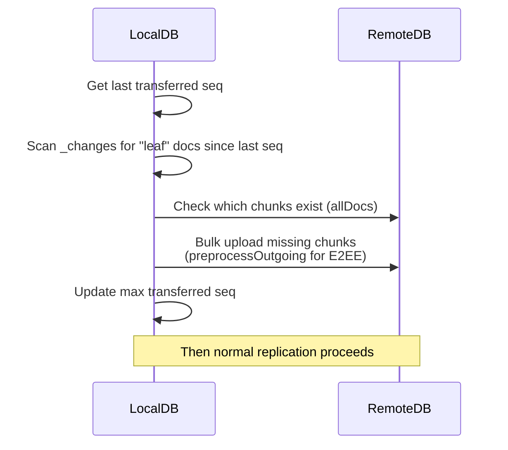
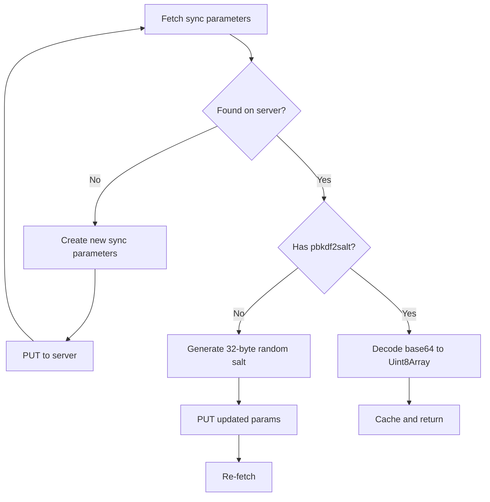

# Replication

## Overview

Obsidian LiveSync uses the CouchDB replication protocol via PouchDB to synchronise data between devices. PouchDB handles the low-level protocol, while the plugin manages lifecycle, error handling, and chunk optimisation.



## PouchDB Replication API

Source: `src/lib/src/replication/couchdb/LiveSyncReplicator.ts:710-720`

| Mode | API Call | Use Case |
|------|---------|----------|
| Bidirectional | `localDB.sync(remoteDB, options)` | One-shot or continuous sync |
| Pull only | `localDB.replicate.from(remoteDB, options)` | Download changes from remote |
| Push only | `localDB.replicate.to(remoteDB, options)` | Upload changes to remote |

### Sync Options

Source: `src/lib/src/replication/couchdb/LiveSyncReplicator.ts:874-886`

```typescript
const syncOptionBase = {
    batches_limit: setting.batches_limit,  // Max concurrent batches
    batch_size: setting.batch_size,        // Docs per batch
};

// For continuous sync:
const syncOption = {
    live: true,
    retry: true,
    heartbeat: setting.useTimeouts ? false : 30000,
    ...syncOptionBase
};
```

## Replication Lifecycle

### One-shot Replication

Source: `src/lib/src/replication/couchdb/LiveSyncReplicator.ts:665-778`



### Continuous Replication

Source: `src/lib/src/replication/couchdb/LiveSyncReplicator.ts:889-950`

1. Perform one-shot pull first (catch up)
2. Start bidirectional live sync with `{live: true, retry: true}`
3. Process events in a loop until cancelled or errored

### Event Processing

Source: `src/lib/src/replication/couchdb/LiveSyncReplicator.ts:307-417`

Events are received via an async generator wrapping PouchDB's event emitter:

| Event | Action |
|-------|--------|
| `change` | Parse documents, update `lastSyncPullSeq`/`lastSyncPushSeq` |
| `active` | Update status to CONNECTED |
| `complete` | Update status to COMPLETED, terminate |
| `error` | Check if retryable (413 → retry with smaller batch) |
| `denied` | Log and terminate |
| `paused` | Update status to PAUSED |

## Sequence Number Tracking

Source: `src/lib/src/replication/couchdb/LiveSyncReplicator.ts:252-268, 334-342`

The plugin tracks replication progress using CouchDB sequence numbers:

| Property | Purpose |
|----------|---------|
| `maxPullSeq` | Total changes on remote (`update_seq` from remote `info()`) |
| `maxPushSeq` | Total changes on local (`update_seq` from local `info()`) |
| `lastSyncPullSeq` | Last pulled sequence number |
| `lastSyncPushSeq` | Last pushed sequence number |

Sequence numbers are extracted from the format `"123-abc..."` → `123` (numeric prefix).

## On-demand Pull

Source: `src/lib/src/replication/couchdb/LiveSyncReplicator.ts:66`

When `readChunksOnline` is enabled, pull replication excludes chunk documents:

```typescript
const selectorOnDemandPull = { selector: { type: { $ne: "leaf" } } };
```

This means only metadata documents (entries) are replicated. Chunks are fetched individually when a file is accessed, reducing bandwidth for vaults with large binary files.

Applied during pull-only replication:
```typescript
localDB.replicate.from(db, {
    ...syncOptionBase,
    ...(setting.readChunksOnline ? selectorOnDemandPull : {}),
});
```

Source: `src/lib/src/replication/couchdb/LiveSyncReplicator.ts:714-717`

## Chunk Pre-sending (sendChunks)

Source: `src/lib/src/replication/couchdb/LiveSyncReplicator.ts:480-663`

Before normal replication, chunks can be sent in bulk to avoid bottlenecks:



### Parameters

| Parameter | Value | Description |
|-----------|-------|-------------|
| Batch check size | 250 | Chunks checked per batch against remote |
| Concurrent uploads | 4 (Semaphore) | Parallel bulk upload tasks |
| Max batch size (bytes) | `setting.sendChunksBulkMaxSize * 1MB` | Configurable |
| Max batch size (count) | 200 | Documents per bulk upload |

### Process

1. Query local `_changes` since last sync seq, filtered by `{ type: "leaf" }`
2. Check remote for existing chunks via `allDocs` (250 at a time)
3. Queue missing chunks in a `Trench` (persistent queue)
4. Dequeue and upload via `remoteDB.bulkDocs()` with `{ new_edits: false }`
5. Apply `preprocessOutgoing` (encryption) before upload
6. Track progress in `_local/max_seq_on_chunk-{remoteID}`

## Milestone and Node Management

### Milestone Document

Source: `src/lib/src/common/models/db.const.ts:4`

```
_id: _local/obsydian_livesync_milestone
```

Used to check version compatibility between devices. Contains a `ChunkVersionRange`:

```typescript
const currentVersionRange: ChunkVersionRange = {
    min: 0,      // Minimum compatible chunk version
    max: 2400,   // Maximum compatible chunk version
    current: 2,  // Current chunk version
};
```

Source: `src/lib/src/replication/couchdb/LiveSyncReplicator.ts:60-64`

The `ensureDatabaseIsCompatible()` function checks:
- Version range overlap between local and remote
- Node lock status (database rebuilt detection)
- Clean-up status

Source: `src/lib/src/replication/couchdb/LiveSyncReplicator.ts:832-872`

Possible results: `OK`, `INCOMPATIBLE`, `LOCKED`, `NODE_LOCKED`, `NODE_CLEANED`, `MISMATCHED`

### Node Info Document

```
_id: _local/obsydian_livesync_nodeinfo
```

Identifies the local device. Each device has a unique `nodeid`.

Source: `src/lib/src/common/models/db.const.ts:5`

### Sync Parameters Document

```
_id: _local/obsidian_livesync_sync_parameters
```

Stores the PBKDF2 salt and protocol version. Since this is a `_local/` document, it is **not replicated** via normal CouchDB replication. Instead, it is fetched directly via HTTP.

Source: `src/lib/src/common/models/sync.definition.ts:10-25`

```typescript
interface SyncParameters extends DatabaseEntry {
    _id: typeof DOCID_SYNC_PARAMETERS;
    type: "sync-parameters";
    protocolVersion: ProtocolVersion;
    pbkdf2salt: string;  // base64-encoded 32-byte salt
}
```

Protocol versions:
```typescript
const ProtocolVersions = {
    UNSET: undefined,
    LEGACY: 1,
    ADVANCED_E2EE: 2,  // HKDF-based E2EE
};
```

### PBKDF2 Salt Lifecycle

Source: `src/lib/src/replication/SyncParamsHandler.ts:64-168`



## preprocessOutgoing

Source: `src/lib/src/pouchdb/encryption.ts:451-456`

The `preprocessOutgoing` function is a module-level variable that applies encryption before sending documents during chunk bulk-sending:

```typescript
export let preprocessOutgoing: (doc: AnyEntry | EntryLeaf) => Promise<AnyEntry | EntryLeaf>;
```

When encryption is disabled, it's a pass-through. When enabled, it applies the same encryption as the PouchDB transform's `incoming` function.

Used in `sendChunks`:
```typescript
const uploadBulkDocTasks = bulkDocs.map(e => preprocessOutgoing(e));
const uploadBulkDocs = await Promise.all(uploadBulkDocTasks);
await remoteDB.bulkDocs(uploadBulkDocs, { new_edits: false });
```

Source: `src/lib/src/replication/couchdb/LiveSyncReplicator.ts:594-596`

## Error Handling and Retry

Source: `src/lib/src/replication/couchdb/LiveSyncReplicator.ts:750-771`

On replication error:
1. If HTTP 413 (payload too large) → retry with halved `batch_size` and `batches_limit`
2. Minimum threshold: `batch_size <= 5 && batches_limit <= 5` → give up
3. On `NEED_RESURRECT` (too many docs in retry) → restart with original settings

## CouchDB Connection

The plugin connects to CouchDB using credentials from settings:

```
URI: setting.couchDB_URI / setting.couchDB_DBNAME
```

Connection check includes:
- Version compatibility check via `checkRemoteVersion()`
- Milestone compatibility via `ensureDatabaseIsCompatible()`
- Tweak settings mismatch detection

Source: `src/lib/src/replication/couchdb/LiveSyncReplicator.ts:788-887`
